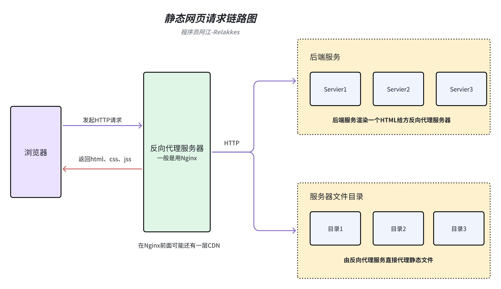
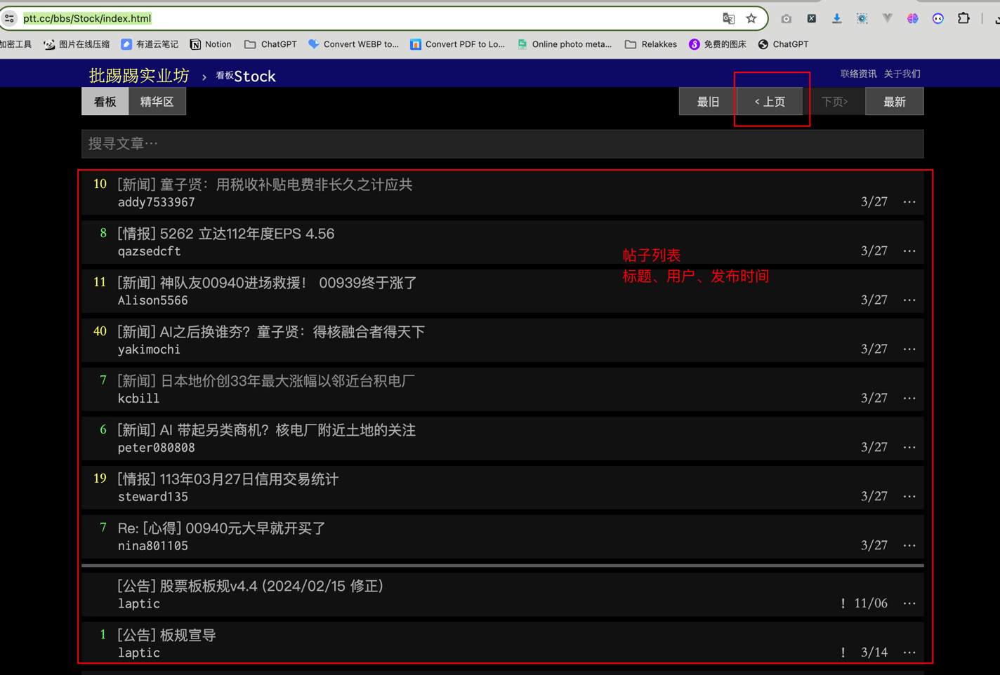
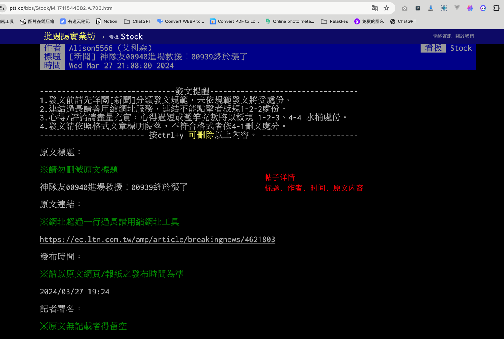
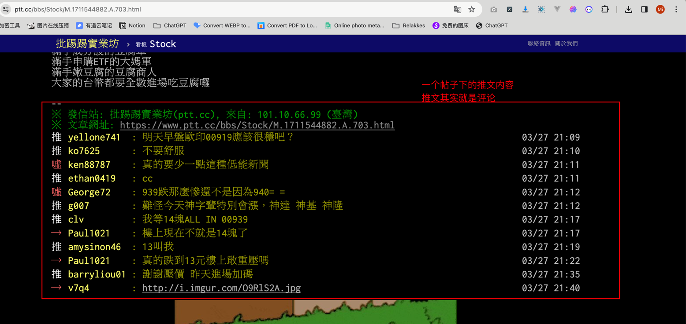
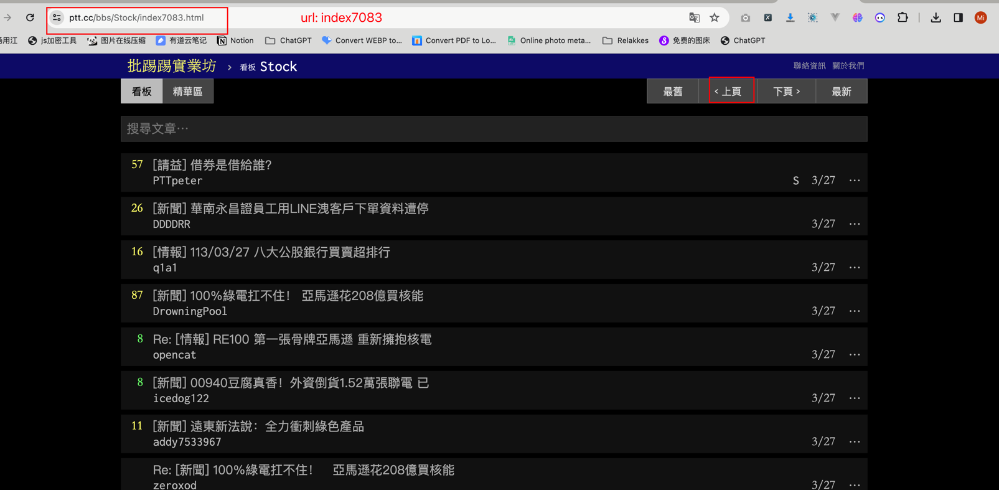
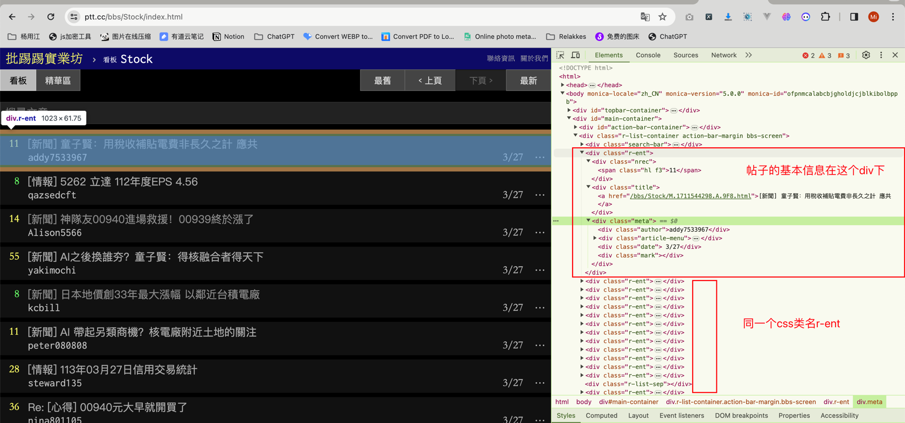

## 爬虫静态网页数据提取
> 为了照顾一些新入门的朋友，本篇的内容html内容解析会用两个库来完成，一个是`BeautifulSoup` 另一个是我比较喜欢用的`parsel`. 大多数新入门朋友可能学习爬虫的时候，都是从BeautifulSoup这个库开始的。

### 什么是静态网页
静态网页是指内容固定不变的网页，它的内容是直接写在 HTML 文件中的，不会因为用户的请求或者其他因素而改变。静态网页的内容通常由 HTML、CSS 和 JavaScript 组成，服务器只需要将这些文件发送给浏览器，浏览器就可以直接解析并显示网页内容。

### 静态网页工作原理
>当用户在浏览器中输入一个静态网页的 URL 时，浏览器会向服务器发送一个 HTTP 请求，请求获取该 URL 对应的 HTML 文件。服务器接收到请求后，会在服务器上查找对应的 HTML 文件，并将其内容发送给浏览器。浏览器接收到 HTML 文件后，会解析其中的 HTML、CSS 和 JavaScript 代码，并根据这些代码渲染出网页内容。




### 爬取静态网页一般需要那些技术
- 会一点点前端的三件套（html、css、js）不会的朋友可以去菜鸟教程上面看一看，只需要简单的入门，知道html标签的一个结构，css选择器的简单用法，js的话暂时不太需要。
- 会使用网络请求哭，比如requests、httpx等
- 会使用解析html的库，比如BeautifulSoup、parsel等
- 会查找静态网页的一个规律
- 存储方面的话看自己需求，如果需要存db这些，就需要自己去了解一些db方面的知识（可选）

## 实战示例
> 下面开始爬虫入门教程系列的第一次代码实战，前面7讲都在将一些理论知识，我们来看看如何将这些理论知识用于实践当中。<br>
> 我的教程都会给大家写两个版本，一个同步请求版本，一个异步请求版本，可能大家在很多别人教程里看见的大多数都是使用requests + BeautifulSoup这一套。<br>
> 我这边给大家再写一套一步的，我为什么很喜欢写爬虫代码喜欢用异步？
> 之前大家如果看过MediaCrawler的源码实现的话，可以看到我整个实现全是基于异步，从发请求、操作数据库、操作db，只要能异步化我都异步化了。
> - 1、这是一种趋势，python一些流行的web框架现在都在往异步方面靠，我们提前用爬虫代码练练手，为后续你可能从事python方面的后端工程师做一些准备
> - 2、性能真的很不错，之前那种多线程爬取的效率有点低，使用异步能在单进程单线内把资源利用发挥到极致。

### 任务需求描述
> 由于合规信息要求，我们的案例大多都会选择一些不在国内的站点来作为爬虫目标站点，技术的原理是想通的。

今天我要爬取的是一个BBS论坛网站的股票讨论部分，目标站点地址：https://www.ptt.cc/bbs/Stock/index.html
需要采集前N页的信息，具体采集内容如下：
- 前N页的帖子列表汇总

- 前N页的每一个帖子内容信息信息

- 前N页的每一个帖子的推文信息（可以理解为评论信息）获取


### 技术可行性分析
#### 1、如何获取前N页中的最新分页Number？
需求中说的是前N页帖子，那么我们是不是要从最新的帖子往前推N页就可以了，理论上我们只需要找出它最新的分页Number就可以了。
我们打开 `https://www.ptt.cc/bbs/Stock/index.html` 并点击`上一页` 按钮，从页面URL `https://www.ptt.cc/bbs/Stock/index7083.html` 可以得出 7083可能是分页Number

我们再点一次`上一页` 按钮，可以发现URL变为了：`https://www.ptt.cc/bbs/Stock/index7082.html`, 那么我们可以初步断定，这个网站的分页模式就是从高到低递减了。<br>
我们如何知道7083这个分页数字？<br>
静态网页一般找这个数字都不难，Chrome浏览器，F12，选中上一页按钮，从html文档中的elements就能看见这个按钮是一个a标签，其中的href属性放着点击该按钮之后要跳转的URL地址。

所以我们只需要使用解析库把这个数字解析出来就可以了

#### 2、html结构分析
> 我们拿帖子列表来做一个简单分析，帖子详情页的类似

同样F12进入控制台，鼠标选择其中一个帖子，查看右边Chrome调试工具的Eelements，可以看到每一个帖子的一块区域所对应的html代码都是由一个`div calss='r-ent'`包裹的.
这种结构化的网页是我们最喜欢看见的，有规律可循，所以下一步就是按需提取信息了。


下面我贴出一个帖子的html代码，然后分别基于两个解析库`BeautifulSoup`、`parsel`提取我们想要的信息

```html
<div class="r-ent">
    <div class="nrec"><span class="hl f3">11</span></div>
    <div class="title">

        <a href="/bbs/Stock/M.1711544298.A.9F8.html">[新聞] 童子賢：用稅收補貼電費非長久之計 應共</a>

    </div>
    <div class="meta">
        <div class="author">addy7533967</div>
        <div class="article-menu">

            <div class="trigger">⋯</div>
            <div class="dropdown">
                <div class="item"><a href="/bbs/Stock/search?q=thread%3A%5B%E6%96%B0%E8%81%9E%5D+%E7%AB%A5%E5%AD%90%E8%B3%A2%EF%BC%9A%E7%94%A8%E7%A8%85%E6%94%B6%E8%A3%9C%E8%B2%BC%E9%9B%BB%E8%B2%BB%E9%9D%9E%E9%95%B7%E4%B9%85%E4%B9%8B%E8%A8%88+%E6%87%89%E5%85%B1">搜尋同標題文章</a></div>

                <div class="item"><a href="/bbs/Stock/search?q=author%3Aaddy7533967">搜尋看板內 addy7533967 的文章</a></div>

            </div>

        </div>
        <div class="date"> 3/27</div>
        <div class="mark"></div>
    </div>
</div>
```

```python
# BeautifulSoup
from bs4 import BeautifulSoup as bs
soup = bs.select("div.r-ent")
print(soup)

# parsel
```


### 简易流程图
> 一般像这一类比较简单的爬虫需求，我几乎不化流程图，但是为了让大家更清楚的知道，我在代码编写前都会给大家画一下，养成一个coding前画图的其实对于自己提升和代码容错都有一定的帮助

### 代码实现